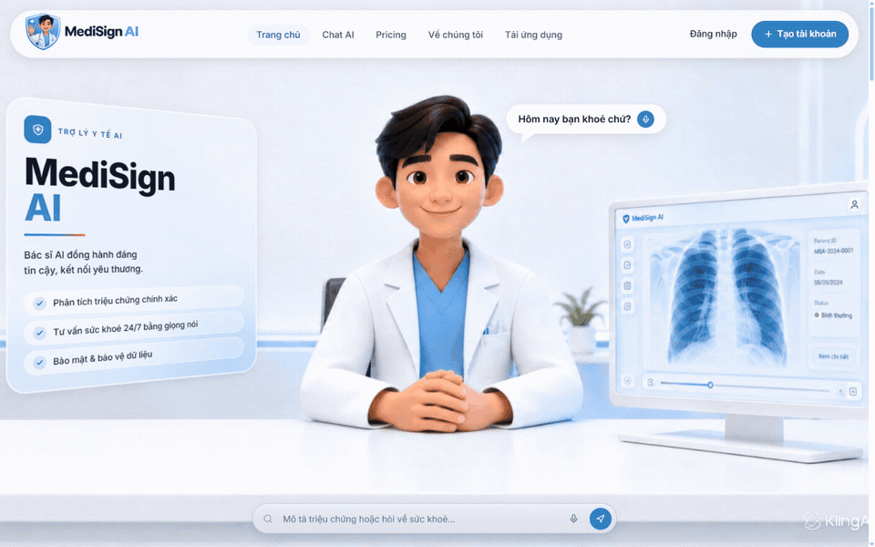
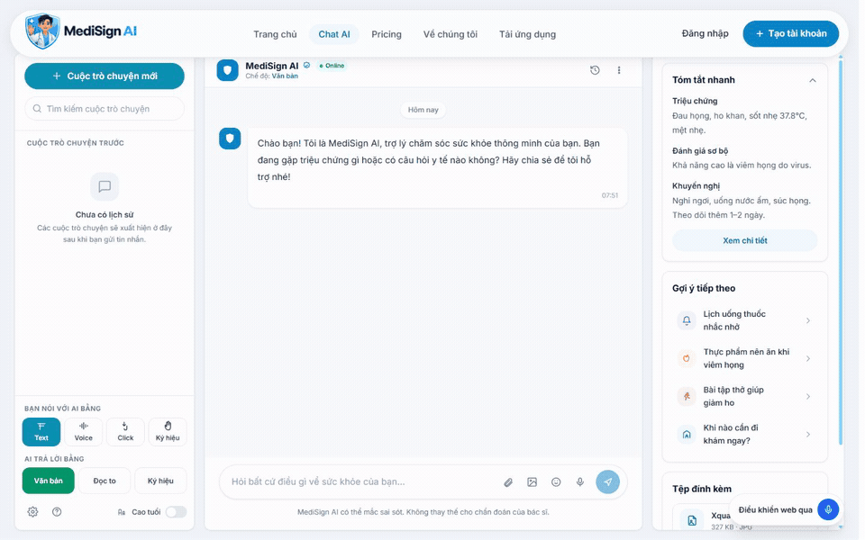
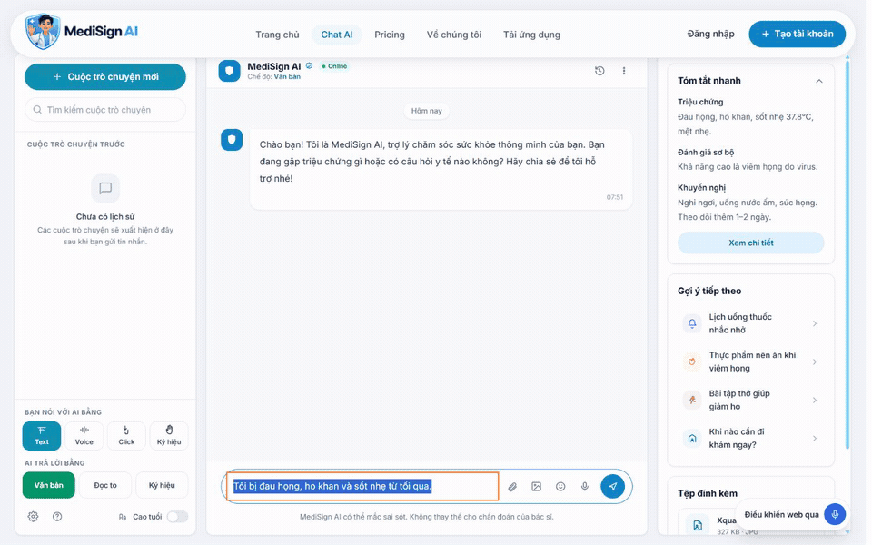
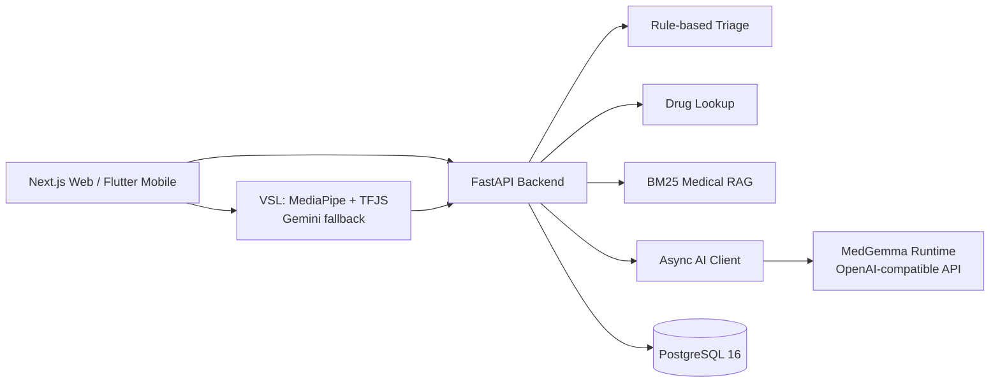

# MediSign AI

<p align="right"><strong>English</strong> · <a href="README.vi.md">Tiếng Việt</a></p>

<p align="center">
  <strong>A multimodal health-assistance platform designed for Vietnamese users</strong><br />
  Symptom triage, medicine lookup, medical RAG, mental wellness, fitness, and Vietnamese Sign Language support.
</p>

<p align="center">
  
  
  
  
  
</p>

MediSign AI is a web-and-mobile health assistance platform for Vietnamese users, with an emphasis on accessibility for older adults, people with disabilities, and families with limited access to healthcare services.

> [!CAUTION]
> MediSign AI provides preliminary decision support only. It does not replace medical diagnosis, professional advice, or treatment. In an emergency in Vietnam, call **115** or go to the nearest medical facility.

## Product preview

<p align="center">
  
</p>
<p align="center"><em>Vietnamese-first entry point for symptom guidance, voice interaction, and accessible health assistance.</em></p>

<p align="center">
  
</p>
<p align="center"><em>Three-column consultation workspace with synthetic symptom input, preliminary assessment, and grounded next-step prompts.</em></p>

<p align="center">
  
</p>
<p align="center"><em>Accessibility controls switch both user input and AI output to Vietnamese Sign Language mode.</em></p>

> [!NOTE]
> Captured at the web application's native 16:10 desktop layout with seeded, non-sensitive demonstration data. The content shown is a product workflow, not a clinical diagnosis.

## Core capabilities

- **Symptom triage** — classifies requests into Green, Yellow, or Red urgency levels through deterministic safety rules and an optional AI path.
- **Medicine lookup** — searches a Vietnamese Drug Administration dataset with registration, active ingredient, manufacturer, contraindication, interaction, and warning fields.
- **Vietnamese medical assistant** — combines `google/medgemma-1.5-4b-it`, domain adapters, and a local BM25 RAG knowledge base.
- **SoulGarden** — mood journaling and mental-wellness support with a dedicated psychology adapter path.
- **Fitness** — workout tracking and on-device pose evaluation.
- **Community** — anonymous health-experience sharing with moderation workflows.
- **Accessibility** — Vietnamese Sign Language recognition, Vietnamese voice interaction, and an elderly-oriented interface.

## Architecture



FastAPI does not load MedGemma inside the API process. The model runs as a separate GPU service exposing an OpenAI-compatible `/v1/chat/completions` endpoint, while the backend communicates with it asynchronously through `httpx`. The rule-based mode remains available without a GPU.

### Deployment modes

| Mode | Primary model | Intended use |
|---|---|---|
| Cloud | MedGemma 1.5 4B with medical/psychology adapters | Highest-capability AI path through a dedicated GPU service |
| Local | Smaller Gemma runtime with LoRA adapters | Offline or privacy-sensitive operation |
| Hybrid | Cloud for complex requests, local fallback | Availability and privacy balance |

The current MVP can run with `BACKEND_AI_PROVIDER=rule_based`, which does not require a GPU and returns a conservative fallback response.

## Engineering benchmark

The repository includes a quantitative benchmark that exercises real backend services. The figures below were recorded in a local `benchmark_full.log` run artifact and can be reproduced with [`scripts/benchmark_real.py`](scripts/benchmark_real.py). The log itself is not tracked in the public repository.

| Area | Evaluation size | Result |
|---|---:|---|
| Rule-based triage | 100 labelled cases | **89.0%** accuracy; **100%** emergency recall; **0.051 ms** mean latency |
| RAG retrieval | 30 medical queries | Hit@1 **93.3% → 96.7%**; Hit@5 **93.3% → 100%**; MRR **93.3% → 97.3%** with synonym expansion |
| Medicine lookup | 64,045 records, 20 queries | **100%** positive recall; 19/20 queries found; **671.66 ms** mean, **3,652.51 ms** p95 |
| Triage throughput | 1,000 local calls | **0.061 ms** mean; **0.099 ms** p99; approximately **16,453 req/s** on the benchmark machine |
| Adapter routing | 9 prompts | Adapter context changed top-1 retrieval for **5/9** prompts |

Run the benchmark from the repository root:

```bash
python scripts/benchmark_real.py --output apps/backend_fastapi/output/benchmark_real_report.json
```

> These are engineering results from small, curated test sets on a local machine. They are not clinical validation, do not demonstrate diagnostic effectiveness, and must not be interpreted as medical-device certification. Latency and throughput depend on hardware and cache state.

## MedGemma and RAG

### Model path

| Component | Current implementation |
|---|---|
| Base model | `google/medgemma-1.5-4b-it` |
| Fine-tuning | QLoRA with 4-bit NF4 quantization |
| Medical adapter | LoRA artifact and 15,693 training records in the pipeline |
| Psychology adapter | LoRA artifact and 1,201 OARS-style training records in the pipeline |
| Runtime | Separate OpenAI-compatible model server with adapter selection |

The adapters and training scripts are present, but fixed quality evaluation is still incomplete. Their presence must not be treated as proof of clinical model quality.

### Retrieval knowledge base

The local RAG path uses BM25-style retrieval over a Vietnamese medical knowledge base containing approximately 128,380 records. Synonym expansion improves several retrieval metrics in the included benchmark, while synonym-dependent Hit@3 remains a known area for further evaluation.

## Vietnamese Sign Language mode

MediSign supports two VSL paths:

1. **On-device real-time recognition** — MediaPipe extracts hand, face, and pose landmarks in the browser. A TensorFlow.js Bi-LSTM model consumes a sliding frame window and applies confidence, margin, and voting gates before emitting a sign.
2. **Gemini video fallback** — the Next.js server route can submit a short clip to Gemini when local recognition is unavailable or insufficient. The API key remains server-side and must never use a `NEXT_PUBLIC_` prefix.

The landmark pipeline produces a 495-dimensional feature vector and is integrated into the chat composer. Current VSL support is an engineering prototype and still requires broader vocabulary and signer-independent validation.

## Technology stack

| Layer | Technologies |
|---|---|
| Backend | Python 3.11+, FastAPI, Pydantic, SQLAlchemy, Alembic, httpx |
| AI and retrieval | MedGemma, QLoRA/PEFT, Transformers, sentence-transformers, BM25 |
| Data | PostgreSQL 16, pgvector, JSON knowledge bases |
| Web | Next.js 14, React 18, TypeScript, React Query, TensorFlow.js, MediaPipe |
| Mobile | Flutter, Riverpod, GoRouter, Dio, Camera, ML Kit, TFLite |
| Vision | Pillow, OpenCV, NumPy, pydicom |
| Testing | pytest, Vitest, Playwright, Flutter test |
| Operations | Docker Compose, separate backend and database services |

## Quick start

### Prerequisites

- Docker Desktop with Compose, or Python 3.11+ and PostgreSQL 16
- Node.js 20+ for the web application
- Flutter SDK 3.4+ for mobile development
- A dedicated GPU runtime only when enabling the MedGemma server

### Docker backend

```bash
git clone https://github.com/VNDT1625/MediSign_AI.git
cd MediSign_AI
Copy-Item .env.example .env   # PowerShell
docker compose up -d --build
```

On macOS/Linux, use `cp .env.example .env`.

### Web application

```bash
cd apps/web_next
npm install
npm run dev
```

### Backend without Docker

```bash
cd apps/backend_fastapi
python -m venv .venv
# PowerShell: .\.venv\Scripts\Activate.ps1
# macOS/Linux: source .venv/bin/activate
pip install -e .
alembic upgrade head
uvicorn app.main:app --reload
```

FastAPI documentation is available at `http://localhost:8000/docs`; the Next.js development server uses `http://localhost:3000` by default.

## Configuration

Important variables include:

| Variable | Purpose |
|---|---|
| `DATABASE_URL` | PostgreSQL connection string |
| `SECRET_KEY` | Backend authentication secret |
| `BACKEND_AI_PROVIDER` | `rule_based` or configured AI runtime path |
| `AI_MODEL_BASE_URL` | OpenAI-compatible MedGemma server URL |
| `AI_MODEL_API_KEY` | Model server credential when required |
| `GOOGLE_GEMINI_API_KEY` | Server-side VSL video fallback |
| `RAG_KB_PATH` | Medical knowledge-base location |
| `DRUG_DATABASE_PATH` | Medicine dataset override |

Never commit real credentials. Browser-visible `NEXT_PUBLIC_*` variables must contain public configuration only.

## API overview

The backend exposes grouped endpoints for:

- authentication and user profiles;
- symptom triage and feedback;
- medicine search and interaction warnings;
- AI chat and RAG-assisted responses;
- SoulGarden and mental-wellness records;
- workouts and fitness goals;
- community posts, moderation, and reports;
- VSL recognition fallback;
- administrative review and knowledge-base promotion.

Use the generated OpenAPI UI at `/docs` as the authoritative development reference.

## Testing

```bash
# Backend
cd apps/backend_fastapi
python -m pytest

# Web
cd apps/web_next
npm test
npm run build

# Mobile
cd apps/mobile_flutter
flutter test
```

## Repository structure

```text
MediSign_AI/
├── apps/
│   ├── backend_fastapi/    # REST API, domain services, migrations, and tests
│   ├── web_next/           # Next.js application and browser VSL pipeline
│   └── mobile_flutter/     # Flutter mobile client
├── packages/
│   ├── ai_training/        # adapter training and evaluation utilities
│   └── shared_contracts/   # shared schemas and contracts
├── data/                   # medicine, knowledge-base, training, and eval data
├── scripts/                # benchmark, training, QA, and operational scripts
├── docs/                   # architecture and training documentation
└── docker-compose.yml      # backend and PostgreSQL services
```

## Project status

| Component | Status | Notes |
|---|---|---|
| Rule-based triage | Implemented | Vietnamese normalization and quantitative benchmark |
| Medicine lookup | Implemented | 64,045-record primary dataset path |
| RAG knowledge base | Implemented | Local BM25 retrieval and automatic reload |
| FastAPI backend | Implemented | Auth, triage, medicine, AI chat, community, and admin paths |
| Next.js web | Implemented | Main user flows and VSL integration |
| VSL recognition | Prototype | On-device TFJS/MediaPipe plus Gemini fallback |
| Flutter mobile | Partial | UI complete in several areas; API integration remains partial |
| MedGemma adapters | Research artifacts | Training/runtime pipeline exists; fixed quality validation is incomplete |
| Vision medicine classifier | Not ready | Requires a sufficiently large labelled image dataset |

Statuses describe implementation evidence in the repository, not production certification or clinical readiness.

## Team

**Project lead:** Nguyen Duy Thuan — Architecture and AI · Student ID 2311555799

**Academic supervisor:** MSc. Do Gia Bao

**Program:** 2026 Student Scientific Research Project · Nguyen Tat Thanh University · Ho Chi Minh City, Vietnam

## Medical disclaimer

MediSign AI is a research and educational prototype. It must not be used as the sole basis for diagnosis, treatment, medication changes, emergency decisions, or other high-stakes medical actions. Production use would require clinical governance, privacy and security review, regulatory assessment, representative evaluation, monitoring, and qualified human oversight.
